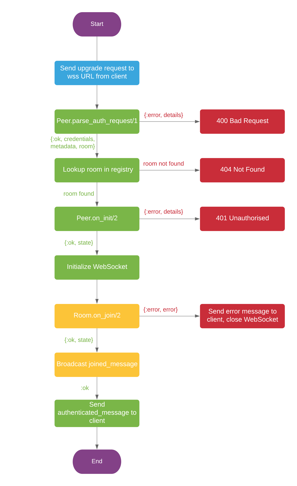

## Initialisation

After receiving request, peer should parse it via 
[`parse_request/1`](./Membrane.WebRTC.Server.Peer.html#c:parse_request/1) callback. Credentials 
and metadata returned from it will be used to create `Membrane.WebRTC.Server.Peer.AuthData`. 
Then, state is initialized in [`on_init/3`](./Membrane.WebRTC.Server.Peer.html#c:on_init/3) and 
authentication is performed with `Membrane.WebRTC.Server.Peer.AuthData` extracted from the 
request. Finally, WebSocket is initialized.

After successful initialization, the peer will try to join the room with the name returned from 
[`parse_request/1`](./Membrane.WebRTC.Server.Peer.html#c:parse_request/1). Authorization (with 
the same `Membrane.WebRTC.Server.Peer.AuthData`) or other checks can be performed in
[`on_join/2`](./Membrane.WebRTC.Server.Room.html#c:on_join/2) callback. After that, the peer will
send 
```
{
    event: "authenticated",
    data: {
        peer_id: peer_id
    }
}
```
message to client to inform about successful initialization and joining a room.



