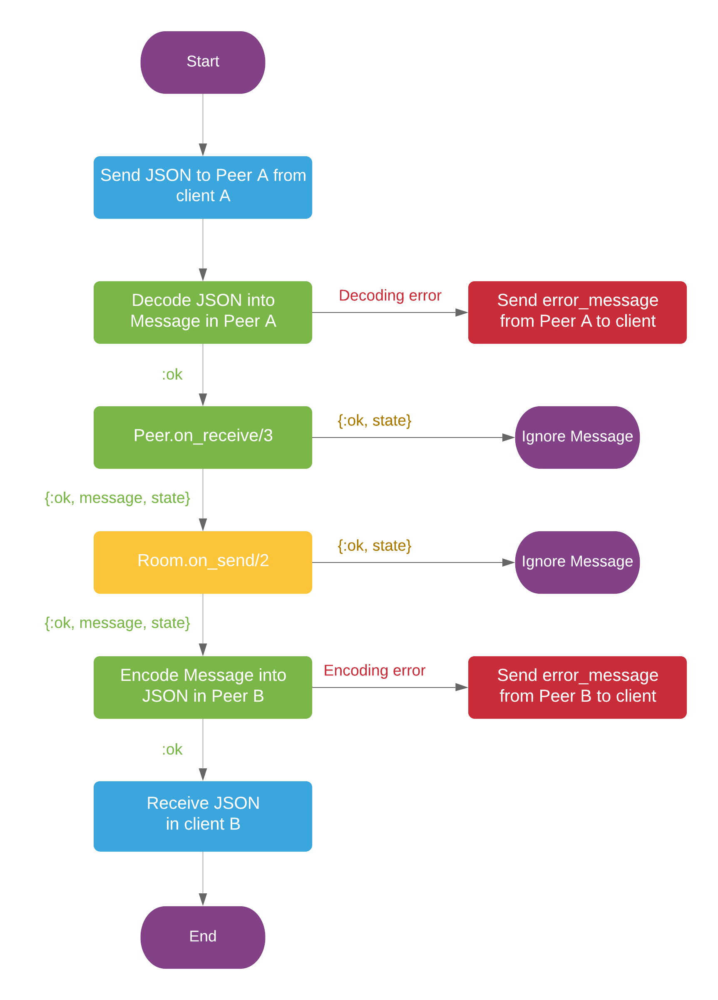

## Signaling

The client communicates with peer by exchanging JSON messages. These messages should have the same
fields as `Membrane.WebRTC.Server.Message`, which is used in internal communication.

Every JSON message received from the client will be decoded into `Membrane.WebRTC.Server.Message`
struct. The peer will set `from` field with own peer_id. Then it will send message to the room, 
where it will be passed to addressee. The addressee and sender are specified in `to` and `from` 
message fields by peer_ids.

The Message can be modified or ignored by both peer and room using `on_receive` callbacks.
Addressee peer, after receiving the message will encode it back to JSON and send it to its client.

